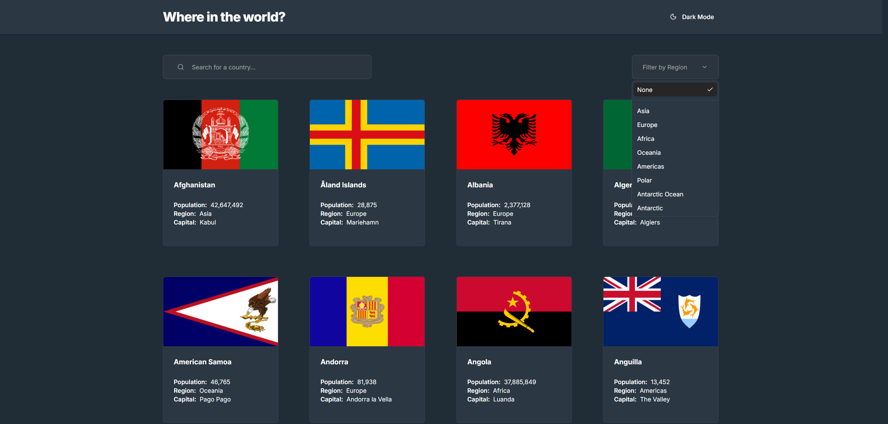

# REST Countries Explorer

Search and explore countries by name and region, with URL-shareable filters and a detailed country view.

🔗 **Live demo:** https://dzh35rg22h5dq.cloudfront.net/
📦 **Repo:** this repo



## Stack

Vite · React · TypeScript · Tailwind CSS · shadcn/ui · React Router · GitHub Actions · AWS S3 · CloudFront

Backend: Node/Express, deployed on Render.

## Deployment

- **CI/CD:** GitHub Actions builds on every push to `main` and syncs to S3
- **Hosting:** AWS S3 (private, OAC-secured) behind CloudFront for HTTPS + CDN
- **Routing fix:** CloudFront custom error responses (403/404 → `index.html`) support client-side routing on refresh/deep-link
- **Cache invalidation:** CloudFront cache invalidated automatically on each deploy
- **Backend:** Node/Express API deployed on Render

## Concepts & Patterns Used

| Pattern                             | Skills Demonstrated                            | Where                                                                                                                            |
| ----------------------------------- | ---------------------------------------------- | -------------------------------------------------------------------------------------------------------------------------------- |
| `useDeferredValue`                  | Performance Optimization, Concurrent Rendering | Search input — keeps typing instant while the filtered list re-render is deprioritized                                           |
| `useTransition`                     | Performance Optimization, Concurrent Rendering | Region selection — marks the resulting re-render as non-urgent, keeps old results visible (faded) while new ones compute         |
| Client-side filtering via `useMemo` | Derived State, Performance Optimization        | Full dataset fetched once; search/region filtering computed synchronously, no network round-trip and no navigation-related flash |
| Custom `useFetch` hook              | Reusable Data Fetching, Error Handling         | Generic hook reused for the full country list                                                                                    |
| State lifted to `Layout`            | State Persistence Across Routes                | Fetch happens once in `Layout`, shared via `Outlet` context — list state survives navigating to a country's detail page and back |
| URL-synced filters                  | Shareable/Bookmarkable State                   | Search and region synced to URL query params via `useSearchParams`                                                               |
| Route-based code splitting          | Code Splitting, Lazy Loading                   | Detail page loaded via `React.lazy` + `Suspense`                                                                                 |
| TS interfaces, no `any`             | Type Safety, Strict Typing                     | `Country` type matches the real API response shape                                                                               |
| Modular components                  | Modularity, Component Composition, Reusability | Card, search input, region select, list, details row — each separated and reusable                                               |

## Key Features

- Debounce-free, always-responsive search across the full country list
- Region filtering with smooth transition between results
- Filters persist across navigation and are shareable via URL
- Country detail page with lazy-loaded route
- Responsive layout, sticky header

## Tradeoffs

- **Frontend-only filtering, not API-triggered:** the full dataset is small enough to fetch once; this avoids a network round-trip per keystroke and eliminates a UI flash that occurred when filtering was API-driven (see commit history). A separate branch (`feature/api-filter`) explores the API-triggered approach instead, for comparison.
- **`useDeferredValue` for search vs. `useTransition` for region select:** chosen deliberately to demonstrate both patterns — search needs instant input feedback (deferred read), while region selection has no typing urgency (deferred write via transition).

## Running Locally

```bash
yarn install
yarn dev
```

## Testing

```bash
yarn test
```

Covers: `useFetch`, `useCountries` (filtering logic), `CountriesListPage` (loading/error/empty states, URL-driven filters, user-driven filters). Skipped: purely presentational components (`TypographyH1`, layout wrappers) with no branching logic.
